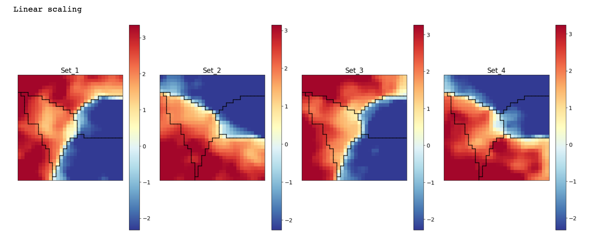
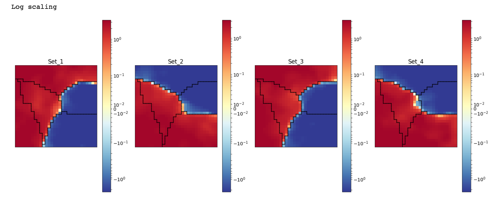
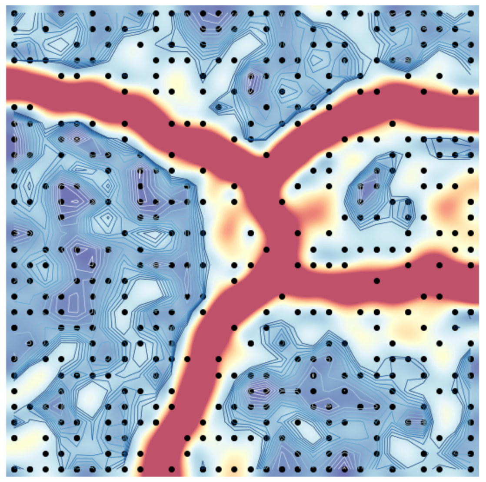

# MSESOM
## About
This repository contains code templates for self-organizing mapping (SOM), a type of unsupervised machine learning. This is work done in the Huang group in MSE at the University of Washington.

## Initial Steps
- Have python on PC either via Miniconda or Anaconda
  - https://docs.conda.io/en/latest/miniconda.html
  - https://www.anaconda.com/
- Have git installed
- Configure your git bash to your account using command below
  - git config --global user.email ”user@email.com”
- Move to the place where you would like the repository (ex below)
- Follow installation instructions (“Installing Repo”)

## How To Install Repo
1. In command window:
   - git clone https://github.com/feliciatd/MSESOM.git
   - Another option is to fork this github to your personal github and clone from there.
2. In command window:
   - cd MSESOM
3. In command window:
   - pip install -r requirements.txt
4. Test to see if the first 3 cells of Sompy_experimentation runs with no error
   1. If there is an error, please see “Troubleshooting” section under “Notes”
5. We recommend that you duplicate the Sompy_experimentation and SOM_Visualization files, and title them accordingly for your personal projects, so that if there are any updates to the code templates, they will not influence any personal changes made to the files

## Pulling (if there are updates)
If there are any updates in the code, we recommend you pull these updates **(overwriting the Sompy_experimentation and SOM_Visualization files)** 
1. In command window:
   - cd MSESOM
2. In command window:
   - git pull

## Confirm Code Works
1. Run Sompy_experimentation with the Dummy Data
2. Take the produced .h5 file and use in SOM_Visualization. The results produced should be as follows:
#### Linear Scaling

#### Log Scaling

#### U Matrix

## Notes
### Troubleshooting
#### Red Text or Error Downloading requirements.txt
- Look at what package produced the error
- pip install package
- rerun pip install requirements.txt

#### Inability to Run code
Some of the conda packages are named differently than in pip. For example, sklearn -> scikit-learn and tables -> pytables. Additionally, conda does not automatically download packages from a URL, so there is need to clone sevamoo's SOMPY into the directory manually and then run setup.py to manually install sevamoo's SOMPY.

#### Error with tf_prop folder
Methods:
- Move the folder into Miniconda3\Lib\site-packages or site-packages location
- Move the folder into the MSESOM folder
- Move the folder into your python installer folder

## Sources
Tim Letz's github for original SOM_Visualization and Sompy_experimentation: https://github.com/timletz/materials_datascience_uw_somlab

matplotlib github for dummydata: https://github.com/matplotlib/matplotlib

Sevamoo's SOMPY: https://github.com/sevamoo/SOMPY
